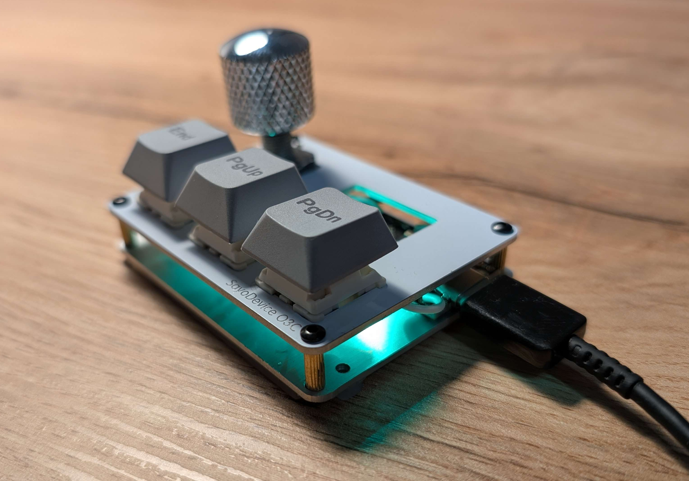
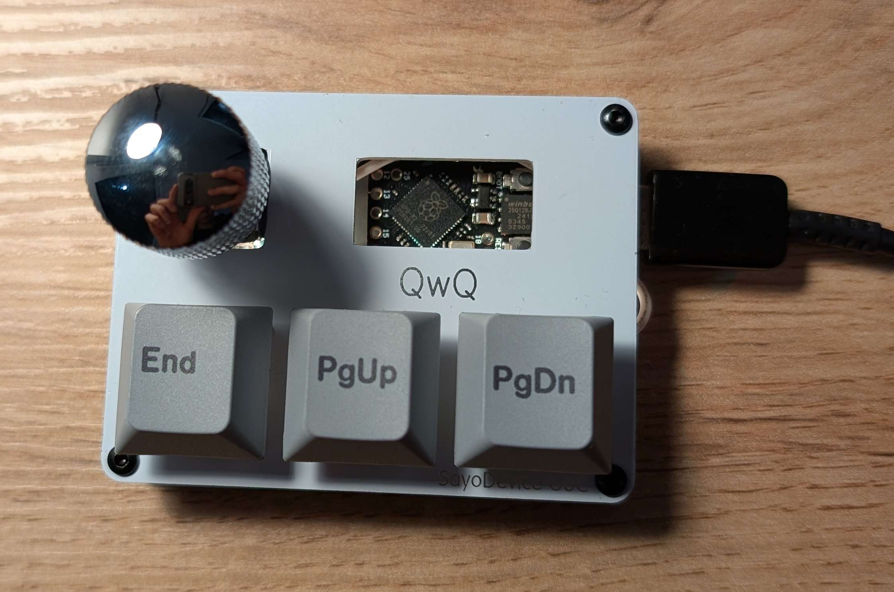
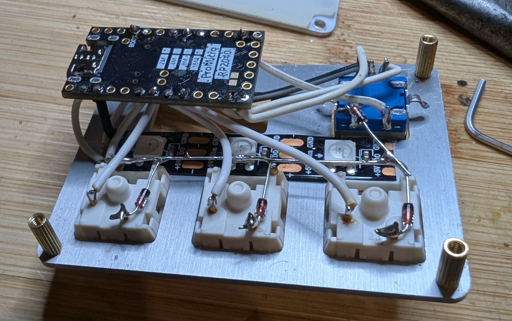

# ⌨️ Instrukcja do klawiaturki

 

Firmware [kmk](https://github.com/KMKfw/kmk_firmware) napisany i konfigurowany w [CircuitPython](https://github.com/adafruit/circuitpython). Także config w pythonie.

## Specs

- mikrokontroler RP2040 (16MB flash)
- przełączniki tactile Holy Panda (czemó? **temu**)
- enkoder EC11
- WS2812b LED (3 diody)
- bez PCB

## Ficzery

- podświetlenie RGB
- 4 warstwy
- enkoder (_rotary encoder_)

## Getting started

Po podłączeniu do PC klawiatura będzie widoczna jako dysk USB pod nazwą `CIRCUITPY`. Do edycji configu nie ma niestety żadnego programu graficznego, ale nie jest to trudne i jest dobra [dokumentacja na GH](https://github.com/KMKfw/kmk_firmware/blob/main/docs/en/README.md). Aby zmienić config wystarczy edytować plik `code.py`. Po każdym jego zapisie klawiaturka się sama odświeży i nowo zapisany config się od razu załaduje.

_Disclaimer: stan klawiatury, tj. obecna warstwa, ustawione (zmienione) podświetlenie nie zostanie zapamiętane i się zresetuje do domyślnych po odłączeniu klawiatury/wyłączeniu PC. Do tego konieczna będzie zmiana domyślnych ustawień w configu._

## Obecna keymapa

### Rotary encoder:
- 1x klik: `MUTE`
- 2x klik: kolejna warstwy
- 3x klik: warstwa RGB
- kręcenie na każdej warstwie zapewnia inną funkcję

### Warstwa 1 MEDIA:

```python
# ,------. ↑ VOL_UP
# | MUTE | ↓ VOL_DOWN            
# |------+-------------.
# |  ◀◀  |  ▶⏸  |  ▶▶  |
# `--------------------'
```

### Warstwa 2 MACRO:

Obecnie zdefiniowane 3 macro. Można oczywiście napisać swoje.

```python
# ,--------. ↑ SCROLL_UP
# |  MUTE  | ↓ SCROLL_DOWN            
# |------+-----------------.
# | swieta | kekw | zbroja |
# `------------------------'
```

### Warstwa 3 RGB:

- `RGB_TG` - wł./wył. podświetlenie
- `RGB_TD` - (1x - 6x klik) - zmiana trybu RGB)
- `RGB_SAT` - zmiana saturacji RGB

```python
# ,--------. ↑ RGB_COLOR_PLUS 
# |  MUTE  | ↓ RGB_COLOR_MINUS
# |--------+------------------.
# | RGB_TG | RGB_TD | RGB_SAT |
# `---------------------------'
```

### Warstwa 4 MOUSE:

👷🔨

```python
# ,------. ↑ SCROLL_RIGHT
# | MUTE | ↓ SCROLL_LEFT            
# |------+-------------.
# |   C  |   H  |   U  |  *
# `--------------------'
```

## Podświetlenie RGB

Dokumentacja tutaj: [link](https://github.com/KMKfw/kmk_firmware/blob/main/docs/en/rgb.md)
Aktualnie domyślnie jest tęcza RGB. Aby to zmienić, np. na kolor statyczny, ustawić wartość `animation_mode` na `AnimationModes.STATIC` w configu i ustawić kolor zmieniając wartości `hue_default`, `sat_default`, `val_default` - formar HSL.

## Tap Dance

Fajna funkcjonalność zastosowana tutaj. W zależności od tego ile razy zostanie kliknięty przycisk (przy zadeklarowanym timeout, aktualnie 550ms)to taki przycisk zostanie wywołany, czy też taka funkcjonalność.

## Tap Hold

Kolejna fajna rzecz (nie zastosowana tutaj w configu akurat). Na kliknięcie i przytrzymanie klawisza są osobne funkcjonalności. Np. jak kliknę Escape to się wywoła `ESC`, ale jak przytrzymam to włączy się `CAPSLOCK`.

## Preview

 
 

## Uwagi końcowe

Nic się nie powinno urwać. Sklejone na klej dwuskładnikowy giga mocny. Czy można wyłączyć montowanie klawiaturki jako dysk przenośny? Chyba tak i trzeba by zmienić ostatnią linijkę configu na `keyboard.go(hid_type=HIDModes.USB)`. 
W razie problemów pisz śmiało. Miłego korzystania, mam nadzieję, że znajdziesz zastosowanie dla tego macropada .
~rysiek
